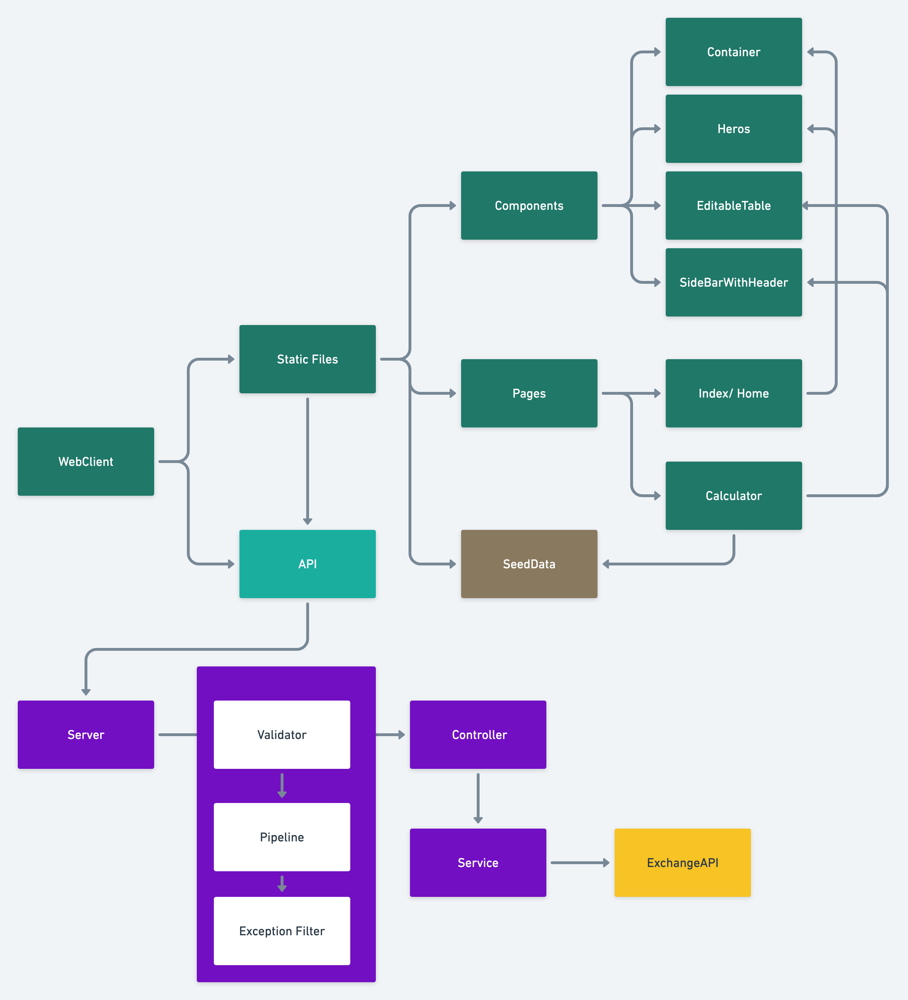

# Net Worth Calculator

This is the web client and server application demo. This application is designed to be simple calculator where user can modify the row or change the currency and get immediate calculation.

The project contains two part web client frontend and web service backend. The webclient frontend is implemented using nextjs and chakra. The backend service is used nestjs framework. In addition to the NestJs framework, I also use the third party service to get exchange rate. [ExchangeAPI](https://app.exchangerate-api.com/)

## Prerequisite

1. node
2. nestjs
3. nextjs

## Running Locally.

Webclient
```
cd webclient
yarn 
yarn dev
```

Service

you would need to sign up for [ExchangeRate](https://app.exchangerate-api.com/) to get api key. create .env file and create variable 
CURRENCY_API=https://v6.exchangerate-api.com/v6/YOURAPIKEY/latest/
```
cd service
yarn start:dev
```

The service need to run on port 3001 before the webclient start.

## Overall Design of the application

The application contain two main components. The backend and and Webclient. 



### Web Client

This application designed to be responsive with the help of Chakra lib. The application using nextjs framework to build the foundation. The web client includes api and static files. 

1. Static Files are the pages. There are home page and calculator page. Inadditon to the pages, there are components factor that being separated in each individual reusable component. 
    - Components
        - Container
        - Heros
        - EditableTable
        - SideBarWithHeader
    - Pages
        - Home page
        - Calculator
2. API: this is server side api running as middleware to communicate with server side. 

### Server

The application is design using nestjs which is the express framwork for nodejs. The application has simple module which is used to interact with the web client frontend. The application bootstrap with all the neccessary component to validate input payload and  exception filter.

- Application Middleware
    - Pipeline
    - validator
    - Exception Filter
- Application Module
    - Controller: control the endpoint
    - Service: The business logic live here. It also talks to ExchangeAPI to get real time exchage rate.


