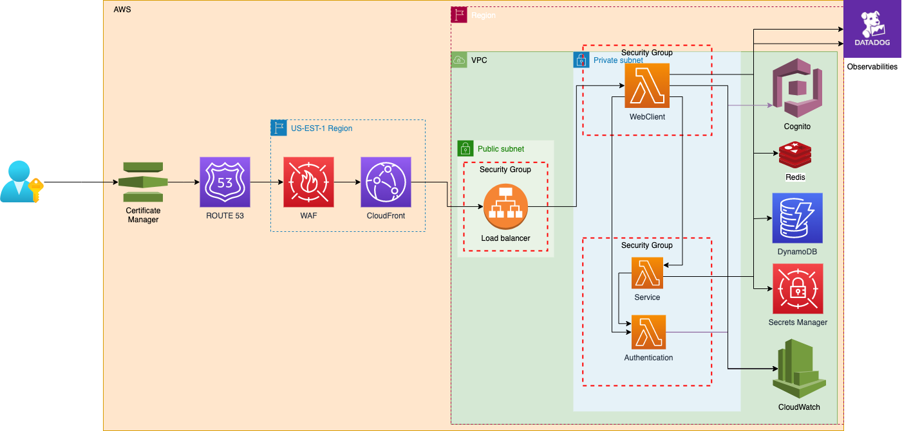

# System Improvement Suggestion
The following are the discussion we should consider to improve the appllication overral.

- What assumptions did you make when implementing your solution and what impact
did they have on the design?
- How would you improve the performance of your application?
- How would you go about testing your application?
- How would you make your service secure?
- How would you globalize your application?
- How would you make your application more resilient to errors? (network, upstream
services, etc)
- How would you take advantage of HTTP caching?
- How would you support multiple users editing concurrently?

### Assumptions and Impact

There are several points that application will assume from user:
- This application is not sharable. It is designed to be sole user only.
- The application is not designed to be used by multiple users.
- The application's data is not driven from other factors like API. It should be manually enter or loaded automatically from setup. Except for the exchange rate.
- The application is not designed to be protected and used locally only. It is not fit to have real data.
- The application has some fit data point like name of each assets or monthly payment of the 
- The application is not supporting high load and super responsive.
- The application is not required to be running on the cloud where user can access from any where.
- The application is not supporting mobile view.
- The number of data row is fixed.
- The user should be able to view the data as manny time as they want

The result of the assumptions lead to design the service to run locally. Since these assumptions above, which lead to the design with the following 
- There is no database handling the update data. 
- The application is not hosting on the cloud.
- The application doesn't have login or sign up. 
- All rows of the data are fixed so storing these data on memory. 
- There is no additional security to protect user's data.
- Making a call to Exchange rate as soon as user change the currency. No cache.

### Improving the performance of application.

Currently, the application is running in the local. From loading webclient point of view, it is technically very fast. However, there are several points to make it the application perform faster. 

- Load the data from service instead from web client.
    - The data can sit in the service memory.
    - Any change from web client, we can send an event down to the service by dispatching method. The event will receive the updated data back. This way, we don't have to send the entire assets data and liabilities data. If there is another data, it could slow down the processing. 
- Bse on the assumption of the application is running locally, The application can improved the performance by the improvement of the hardware on the computer that running on the service.
- The frontend application can be improved by packaging all the support file using webpack

If the application is hosting on the cloud, then there are several point to improve the application. More detail on how would the application be globalize.

### Testing
Base on the assumption of the application running locally, these are following testing I would do to make sure the application correctly.

**WebClient**
- Unit test all components making sure it render correctly. (Jest)
- Create storybook for manual testing.
- Integration test using [cypress](https://www.cypress.io/). 

**Server**
- Unit test all functional. 
- Integration test. Nestjs provided a httpserver to support integration test.
- Performance testing / load test using [K6](https://k6.io/)
- Chaos testing. There are a lot of resources around what and how. 

### Secure service and application
Base on the assumption of the application running in local, then the application need to be secured through the computer that is running the application. 

However, once we make the service or application globalization, there are several points we need to secure the application. Follow best practice through [OWASP](https://owasp.org/)

WebClient 
- Adding Authentication for application to secure who can access the application.
- Prevent SQL injection. 
- Protecting DoD
- Adding JWT to secure connection between webclient and service.
- Put the application inside the private network. more on globalize the application.
- Add dependbot to continuously update anything that might caused security risk.
- add security scan within CICD to prevent any security risk from dependency

Service.
- Put Service in VPC
- Secure connection through JWT.
- Adding Web application firewall to prevent DoS
- Keep all API secret in secret manager with rotation through automation.
- If the application is hosting through container or any cloud machine instance, it also needs patching regularly, and need to be scan constantly 
- Adding security scan within CICD to scan for security risk from depencency packages.
- Use least previledge principle in the application.
- Protect sensitive data through encryption in the database. 
- secure both cache and database through security group. 
- Adding logging and monitoring to detect monoly or anything inefficency from attacker. 
- Prevent event injection.

### Globalization the application.

Overral architect of infrastruture. 
- The cloudfront and Web Application Firewall will be deploy according to region. 
- The service and web client will be spread accross different region. 
- We use Route53 with latency record set to adjust the traffic. 
- We secure all request with certificate to encrypt all connection.
- We secure all services, webclient and resources behide private network. 
- Adding Database to keep data persistence. 

Create the infrastructure using CDK as above diagram. 

### Application resilient to error

